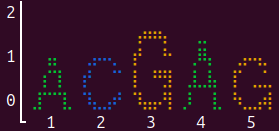
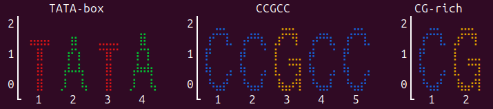
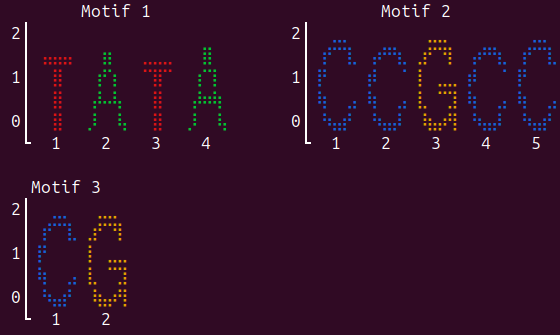

# PWMPrettyPrint.jl

[](https://github.com/kchu25/PWMPrettyPrint.jl/actions/workflows/CI.yml?query=branch%3Amain)
[](https://codecov.io/gh/kchu25/PWMPrettyPrint.jl)

Render **DNA/RNA sequence logos** directly in the terminal — no plotting library required.

Letters are drawn as coloured Unicode [braille](https://en.wikipedia.org/wiki/Braille_Patterns) glyphs, giving each character cell a 2 × 4 sub-pixel grid for crisp, uniform-colour rendering at minimal size. Heights are scaled by [information content](https://en.wikipedia.org/wiki/Sequence_logo) (bits).



## Installation

```julia
using Pkg
Pkg.add("PWMPrettyPrint")
```

## Usage

Pass any 4 × L position-frequency matrix:

```julia
using PWMPrettyPrint

pfm = [0.7  0.1  0.05 0.8  0.1;   # A
       0.1  0.7  0.05 0.05 0.1;   # C
       0.1  0.1  0.85 0.05 0.7;   # G
       0.1  0.1  0.05 0.1  0.1]   # T

logoshow(pfm)
```

Or wrap the matrix in a `PWM` struct so it pretty-prints automatically in the REPL:

```julia
w = PWM(pfm)
w          # prints the logo on display
```

### RNA mode

```julia
logoshow(pfm; rna=true)   # uses A/C/G/U alphabet
```

### Options

| Keyword | Default | Description |
|---------|---------|-------------|
| `height` | `5` | Terminal rows (effective pixel height = 4 × height) |
| `col_width` | `10` | Pixel columns per position (must be even) |
| `rna` | `false` | Use A/C/G/U instead of A/C/G/T |
| `background` | uniform 0.25 | Background nucleotide frequencies for IC calculation |

```julia
logoshow(pfm; height=10, col_width=14)
```

### Custom background frequencies

By default IC is computed against a uniform background (0.25 each). Pass a
4-element vector `[A, C, G, T]` to use genome-specific frequencies instead:

```julia
# Human genome: ~41% GC content
bg = [0.295, 0.205, 0.205, 0.295]   # [A, C, G, T]
logoshow(pfm; background=bg)

# or with the PWM wrapper
w = PWM(pfm; background=bg)
w
```

Letters whose frequency barely exceeds the background will be drawn shorter,
making the logo more informative for GC-rich or AT-rich genomes.

### Multiple logos

Display several motifs side-by-side with auto-numbered or custom titles:

```julia
# rows = [A, C, G, T]
# TATA-box: T-A-T-A (with noise)
tata = [0.08 0.85 0.05 0.88;   # A
        0.06 0.04 0.08 0.03;   # C
        0.04 0.06 0.07 0.05;   # G
        0.82 0.05 0.80 0.04]   # T

# CCGCC: C-C-G-C-C (with noise)
ccgcc = [0.03 0.04 0.02 0.05 0.02;  # A
         0.90 0.88 0.03 0.87 0.91;  # C
         0.04 0.05 0.92 0.04 0.04;  # G
         0.03 0.03 0.03 0.04 0.03]  # T

# CG dinucleotide: C-G (with noise)
cg = [0.03 0.04;   # A
      0.92 0.04;   # C
      0.03 0.91;   # G
      0.02 0.01]   # T

# Auto-numbered titles ("Motif 1", "Motif 2", …)
logoshow([tata, ccgcc, cg])

# Custom names
logoshow([tata, ccgcc, cg]; names=["TATA-box", "CCGCC", "CG-rich"])
```


```
# Control layout: 2 logos per row, 5-column gap
logoshow([tata, ccgcc, cg]; per_row=2, gap=5)
```


| Keyword | Default | Description |
|---------|---------|-------------|
| `names` | `nothing` | Vector of title strings, or `nothing` for auto-numbered |
| `per_row` | `3` | Maximum number of logos per row |
| `gap` | `3` | Blank columns between side-by-side logos |

## Colours

| Letter | Colour |
|--------|--------|
| A | 🟢 Green |
| C | 🔵 Blue |
| G | 🟡 Amber |
| T / U | 🔴 Red |

## How it works

Each position column is rasterised into a pixel grid (`4×height` rows × `col_width` cols). Letter glyphs are polygon outlines (sourced from [LogoPlots.jl](https://github.com/BenjaminDoran/LogoPlots.jl)) ray-cast to a binary bitmap, then scaled to each letter's information-content height and composited. The pixel grid is encoded into Unicode braille characters (U+2800–U+28FF) for output — each terminal character cell carries 2 × 4 = 8 sub-pixels — with 24-bit ANSI foreground colour. No supersampling or alpha blending is used, so colours are always uniform and rendering is fast (~0.1 ms per logo after first call).
